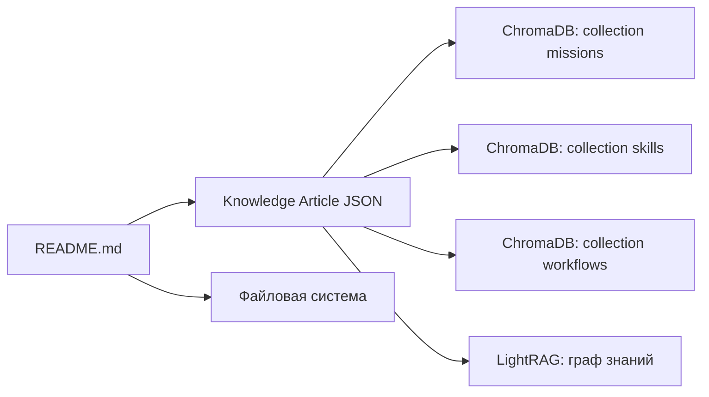

# Kapelka — Миссия: Аудит, Деплой и Поддержка сайтов

**Дата создания:** 07.05.2026
**Статус:** Подготовка (Фаза 0)
**Руководитель:** Конструктор Сети (`agent.constructor.v1`)

---

## Оглавление

1. [Назначение миссии](#1-назначение-миссии)
2. [Команда Kapelka](#2-команда-kapelka)
3. [Полный цикл работ с заказчиком](#3-полный-цикл-работ-с-заказчиком)
4. [5 модулей навыков аудитора](#4-5-модулей-навыков-аудитора)
5. [Файловая структура проекта](#5-файловая-структура-проекта)
6. [Интеграция с памятью WATERS](#6-интеграция-с-памятью-waters)
7. [SLA и метрики](#7-sla-и-метрики)
8. [Шаблоны и артефакты](#8-шаблоны-и-артефакты)

---

## 1. Назначение миссии

Kapelka — временная проектная группа внутри WATERS, созданная для оказания услуг внешним заказчикам:

- **Аудит** готовых сайтов/фронтендов (баги, безопасность, производительность)
- **Исправление** выявленных проблем
- **Деплой** на хостинг (Reg.ru и другие)
- **Поддержка** (мониторинг, обновления, SRE)

Миссия может масштабироваться: от разовых аудитов до долгосрочного сопровождения.

---

## 2. Команда Kapelka

```
           ┌─────────────────────────────────┐
           │  КОНСТРУКТОР СЕТИ (agent.constructor.v1) │
           │  Руководитель группы              │
           │  DevOps-архитектор                │
           │  Принимает заказы, распределяет   │
           └───────────────┬─────────────────┘
                          │
          ┌───────────────┼───────────────┐
          ▼               ▼               ▼
   ┌──────────────┐ ┌──────────────┐ ┌──────────────┐
   │ АРХИТЕКТОР   │ │ КОНСТРУКТОР  │ │ АУДИТОР      │
   │ Kapelka      │ │ Kapelka      │ │ Kapelka      │
   │              │ │              │ │              │
   │ План аудита  │ │ Конфиги инфры│ │ Запуск тестов│
   │ Структура    │ │ Docker/CI/CD │ │ Анализ       │
   │ отчётов      │ │ Deploy-      │ │ Отчёты       │
   │              │ │ шаблоны      │ │ Алерты       │
   └──────────────┘ └──────────────┘ └──────────────┘
```

### Роли

| Агент | Код | Задача |
|-------|-----|--------|
| **Архитектор Kapelka** | `agent.architect.kapelka.v1` | Получает заказ → проектирует план аудита (что проверять, в каком порядке, какими инструментами) |
| **Конструктор Kapelka** | `agent.constructor.kapelka.v1` | Получает план аудита → готовит инфраструктуру: конфиги, Docker-команды, CI/CD, deploy-шаблоны |
| **Аудитор Kapelka** | `agent.auditor.kapelka.v1` | Получает конфиги → запускает инструменты, собирает результаты, формирует отчёт, бьёт тревогу при критических уязвимостях |

### Коммуникация

```
┌────────────────────────────────────────────────────────────┐
│                    КАНАЛЫ СВЯЗИ                            │
├────────────────────────────────────────────────────────────┤
│  Приказы:      orders.constructor.v1  (от Конструктора)    │
│  Планы:        planners.answers.v1    (между агентами)     │
│  Отчёты:       planners.answers.v1    (результат аудита)   │
│  Алерты:       alerts.security.v1     (критические CVE)    │
│  Знания:       knowledge.articles.v1  (в базу знаний)      │
│  Секреты:      secrets.requests.v1    (через Хранителя)    │
└────────────────────────────────────────────────────────────┘
```

Режимы работы:
- **Kafka-режим** — когда кластер доступен (внутри WATERS)
- **File-режим** — когда Kafka недоступна (на сервере заказчика, на Reg.ru)

---

## 3. Полный цикл работ с заказчиком

### Фаза 0: Подготовка (ДО получения доступа к проекту)

**Что делаем сейчас, пока ждём GitHub:**

1. Создаём структуру `missions/kapelka/`
2. Параметризуем агентов (вынос путей/хостов в переменные окружения)
3. Готовим deploy-шаблоны (Nginx, CI/CD, Docker)
4. Готовим чеклисты аудита
5. Наполняем базу знаний WATERS (статьи о методологии аудита)

### Фаза 1: Аудит и тестирование (3-5 дней)

#### День 1 — Получение доступа

| Шаг | Действие | Ответственный |
|-----|----------|---------------|
| 1.1 | Получаем доступ к GitHub (коллаборатор) | Конструктор |
| 1.2 | Клонируем репозиторий | Конструктор |
| 1.3 | Изучаем: README, package.json, .env.example, структуру | Архитектор |
| 1.4 | Получаем от заказчика доступы: Reg.ru, домен, RPC, API-ключи | Конструктор |
| 1.5 | Создаём workspace: `missions/kapelka/clients/<client_name>/` | Конструктор |
| 1.6 | Запускаем `agent_architect` → пишет план аудита | Архитектор |

#### День 2 — Статический аудит

| Шаг | Инструмент | Что проверяем | Навык |
|-----|------------|---------------|-------|
| 2.1 | `npm audit` | Уязвимые зависимости | dependency-scanner |
| 2.2 | ESLint + TypeScript | Ошибки типов и кода | code-quality |
| 2.3 | truffleHog / gitleaks | Зашитые ключи, токены, пароли | secret-scanner |
| 2.4 | Vite bundle visualizer | Размер бандла, sourcemap leak | bundle-analyzer |
| 2.5 | Ручная проверка | Конфиги: Vite, Nginx, Docker, .env | — |
| 2.6 | Anchor CLI (если есть) | IDL, signers, CPI safety | anchor-connector |
| 2.7 | `agent_auditor` | Собирает отчёт по Фазе 1 | — |

#### День 3 — Динамический аудит

| Шаг | Инструмент | Что проверяем | Навык |
|-----|------------|---------------|-------|
| 3.1 | `npm run build` / `npm run dev` | Собираемость, ошибки сборки | — |
| 3.2 | Lighthouse CI | FCP, LCP, TBT, CLS, SI | lighthouse-runner |
| 3.3 | curl / securityheaders.com | CSP, HSTS, X-Frame-Options, CORS | header-inspector |
| 3.4 | testssl.sh / SSLyze | SSL/TLS, протоколы, шифры | nginx-hardener |
| 3.5 | Интеграционные тесты | Вызов Anchor IDL, ответы бека | api-response-validator |
| 3.6 | axe-core | WCAG, a11y, контрастность | a11y-scanner |
| 3.7 | `agent_auditor` | Полный отчёт по Фазе 1 + алерты | — |

#### Артефакты Фазы 1:

```
missions/kapelka/clients/<client_name>/
├── reports/
│   ├── audit_plan.json          # План от архитектора
│   ├── static_audit_report.json # Статический аудит
│   ├── dynamic_audit_report.json # Динамический аудит
│   └── summary_report.md        # Сводка для заказчика
└── artifacts/
    ├── lighthouse_report.html    # HTML-отчёт Lighthouse
    ├── npm_audit.json            # Результаты npm audit
    └── ssl_scan.txt              # Результаты testssl
```

### Фаза 2: Исправление (2-7 дней)

#### Триаж проблем

Используем CVSS (Common Vulnerability Scoring System):

| Уровень | CVSS | Срок | Цвет |
|---------|------|------|------|
| Critical | 9.0-10.0 | Fix NOW (часы) | ⚡ |
| High | 7.0-8.9 | Fix TODAY (день) | 🔴 |
| Medium | 4.0-6.9 | Fix THIS WEEK | 🟡 |
| Low | 0-3.9 | Fix IF TIME | 🟢 |

#### Порядок исправления

**1. Безопасность (самое важное):**
- Удалить хардкодные ключи/токены из репозитория
- Настроить CSP, HSTS, X-Frame-Options, security headers
- Закрыть XSS-векторы (dangerouslySetInnerHTML, unsafe refs)
- Закрыть CSRF-векторы (проверка токенов в API)
- Обновить уязвимые зависимости (npm audit fix)
- Настроить rate limiting на Nginx

**2. Производительность:**
- Code splitting (React.lazy, Suspense)
- Lazy loading изображений и компонентов
- Оптимизация изображений (webp, avif, сжатие)
- Кэширование (Service Worker, CDN, браузерный кэш)
- Tree-shaking, удаление dead code

**3. Интеграция с Solana:**
- Проверить правильность Anchor IDL-вызовов
- Обработка ошибок RPC (таймауты, fallback)
- Wallet adapter: disconnect/reconnect, ошибки
- PDA derivation: правильность seeds

**4. Deploy-readiness (готовность к продакшну):**
- .env.production — все переменные окружения
- Nginx config под продакшн (gzip, cache, security)
- Dockerfile (если нужна контейнеризация)
- CI/CD пайплайн (GitHub Actions)

#### Верификация

После каждого исправления → повторный запуск соответствующего теста.

Финальный документ: **отчёт закрытия** — что было найдено → что исправлено → что осталось (с обоснованием).

### Фаза 3: Деплой на Reg.ru (1-2 дня)

#### Вариант A: VPS (рекомендуется)

**Шаг 1 — Заказ и установка:**
1. Заказываем VPS у Reg.ru (минимально: 2 vCPU, 2GB RAM, 20GB SSD)
2. ОС: Ubuntu 22.04 LTS
3. Подключаемся по SSH

**Шаг 2 — Базовая настройка сервера:**
```bash
# Обновление системы
apt update && apt upgrade -y

# Установка ПО
apt install -y nginx certbot python3-certbot-nginx nodejs npm git curl ufw

# Firewall
ufw allow 22/tcp
ufw allow 80/tcp
ufw allow 443/tcp
ufw enable

# Node.js (LTS)
curl -fsSL https://deb.nodesource.com/setup_20.x | bash -
apt install -y nodejs
```

**Шаг 3 — Деплой приложения:**
```bash
# Клонируем
git clone <repo-url> /var/www/<project>
cd /var/www/<project>

# Установка и сборка
npm ci
npm run build

# Настройка прав
chown -R www-data:www-data /var/www/<project>
```

**Шаг 4 — Nginx конфиг:**
```nginx
server {
    listen 80;
    server_name example.com www.example.com;
    return 301 https://$server_name$request_uri;
}

server {
    listen 443 ssl http2;
    server_name example.com www.example.com;

    root /var/www/<project>/dist;
    index index.html;

    # SSL
    ssl_certificate /etc/letsencrypt/live/example.com/fullchain.pem;
    ssl_certificate_key /etc/letsencrypt/live/example.com/privkey.pem;

    # Security headers
    add_header Strict-Transport-Security "max-age=31536000; includeSubDomains" always;
    add_header X-Frame-Options "DENY" always;
    add_header X-Content-Type-Options "nosniff" always;
    add_header Referrer-Policy "strict-origin-when-cross-origin" always;

    # SPA fallback
    location / {
        try_files $uri $uri/ /index.html;
    }

    # Static assets
    location /assets/ {
        expires 1y;
        add_header Cache-Control "public, immutable";
    }
}
```

**Шаг 5 — SSL:**
```bash
certbot --nginx -d example.com -d www.example.com
```

**Шаг 6 — CI/CD (GitHub Actions):**
```yaml
name: Deploy
on:
  push:
    branches: [main]
jobs:
  deploy:
    runs-on: ubuntu-latest
    steps:
      - uses: actions/checkout@v4
      - uses: actions/setup-node@v4
        with:
          node-version: 20
      - run: npm ci
      - run: npm run build
      - run: npm test
      - name: Deploy to Reg.ru
        uses: easingthemes/ssh-deploy@main
        with:
          SSH_PRIVATE_KEY: ${{ secrets.SSH_PRIVATE_KEY }}
          REMOTE_HOST: ${{ secrets.REMOTE_HOST }}
          REMOTE_USER: ${{ secrets.REMOTE_USER }}
          SOURCE: dist/
          TARGET: /var/www/<project>/dist
      - name: Restart Nginx
        uses: appleboy/ssh-action@v1
        with:
          host: ${{ secrets.REMOTE_HOST }}
          username: ${{ secrets.REMOTE_USER }}
          key: ${{ secrets.SSH_PRIVATE_KEY }}
          script: sudo systemctl reload nginx
```

#### Вариант B: Обычный хостинг

1. Собираем проект локально: `npm run build`
2. Загружаем папку `dist/` через FTP/rsync в `public_html`
3. Настраиваем через панель хостинга Reg.ru:
   - Привязка домена
   - SSL-сертификат
   - .htaccess для SPA-роутинга

#### Домен и DNS

1. В панели Reg.ru: привязываем домен к хостингу
2. DNS-записи:
   - `A` → IP сервера
   - `www CNAME` → @
   - (опционально) `solana CNAME` → RPC-провайдер
3. SSL: Let's Encrypt auto-renew
4. Проверка: HTTPS, редирект www, HSTS

#### Финальная проверка деплоя

- [ ] Сайт открывается по HTTPS
- [ ] Сертификат валиден
- [ ] SPA-роутинг работает (/about, /contact — не 404)
- [ ] Solana RPC отвечает
- [ ] Wallet подключается и подписывает
- [ ] Все страницы загружаются
- [ ] Mobile-friendly (responsive)
- [ ] Lighthouse > 80 по всем метрикам
- [ ] Security headers на месте

### Фаза 4: Поддержка (постоянно)

#### Регулярные задачи

| Период | Действие | Инструмент |
|--------|----------|------------|
| Еженедельно | Проверка новых CVE в зависимостях | npm audit, Dependabot |
| Еженедельно | Тренды производительности | Lighthouse CI |
| Еженедельно | Uptime check | UptimeRobot / Better Uptime |
| Ежемесячно | Полный security-скан | SSLyze, headers check, ZAP |
| Ежемесячно | Проверка SSL-сертификата | certbot renew --dry-run |
| Ежемесячно | Очистка логов | logrotate |
| Ежемесячно | Отчёт заказчику | Сводка метрик и алертов |
| Ежеквартально | Обновление major-версий | Node.js, npm-пакеты |
| Ежеквартально | Аудит безопасности (full) | Полный цикл Фазы 1 |

#### Экстренные ситуации (SLA)

| Ситуация | Время реакции | Действие |
|----------|---------------|----------|
| Сайт не открывается (crash) | 1 час | Рестарт, диагностика |
| Security breach | 30 мин | Отключение, анализ, патч |
| SSL-сертификат истёк | 1 час | Обновление сертификата |
| DDoS-атака | 30 мин | Включение Cloudflare/Reg.ru защиты |
| Solana RPC не отвечает | 2 часа | Переключение на backup RPC |

---

## 4. 5 модулей навыков аудитора

Аудитор Kapelka (`agent.auditor.kapelka.v1`) — универсальный агент, содержащий все 5 модулей как встроенные навыки. Он вызывает внешние инструменты и агрегирует результаты.

### Модуль A: Frontend Auditor

Проверяет само приложение: код, сборку, производительность, доступность.

| Навык | Инструменты | Что проверяет |
|-------|-------------|---------------|
| `lighthouse-runner` | Lighthouse CI, PageSpeed Insights | FCP, LCP, TBT, CLS, SI — производительность |
| `bundle-analyzer` | Vite bundle visualizer, source-map-explorer | Размер бандла, tree-shaking, dead code, sourcemap leak |
| `a11y-scanner` | axe-core, WAVE, Lighthouse a11y | WCAG, ARIA, контрастность, навигация с клавиатуры |
| `seo-validator` | Structured Data Testing Tool, анализ мета-тегов | Open Graph, Twitter Cards, sitemap.xml, robots.txt, hreflang |
| `code-quality` | ESLint, TypeScript strict, Prettier | Типы, линтинг, стиль кода |

### Модуль B: Security Auditor

Проверяет уязвимости: зависимости, заголовки, секреты, OWASP Top 10.

| Навык | Инструменты | Что проверяет |
|-------|-------------|---------------|
| `dependency-scanner` | npm audit, Snyk, Dependabot, Trivy | CVE в зависимостях, supply chain, outdated packages |
| `header-inspector` | curl, securityheaders.com, Mozilla Observatory | CSP, HSTS, X-Frame-Options, CORS, Permissions-Policy |
| `secret-scanner` | truffleHog, gitleaks, GitGuardian | Хардкод ключи, токены, пароли в репозитории |
| `xss-csrf-tester` | OWASP ZAP, ручные тесты | XSS, CSRF, unsafe dangerouslySetInnerHTML |

### Модуль C: Integration Tester

Проверяет связь фронта с Solana-бэком.

| Навык | Инструменты | Что проверяет |
|-------|-------------|---------------|
| `anchor-connector` | Anchor CLI, @solana/web3.js | RPC endpoints, подпись транзакций, PDA derivation |
| `api-response-validator` | Vitest, Jest | Правильность ответов бека, обработка ошибок, таймауты |
| `wallet-tester` | Phantom, Backpack эмуляция | Wallet adapter: connect/disconnect, sign, ошибки |
| `network-tester` | curl, solana CLI | Подключение к Solana cluster (devnet → mainnet) |

### Модуль D: DevOps Engineer

Занимается сервером, CI/CD, контейнеризацией.

| Навык | Инструменты | Что делает |
|-------|-------------|------------|
| `nginx-hardener` | testssl.sh, SSLyze, nginx -t | SSL/TLS, rate limiting, proxy config, security headers |
| `ci-cd-pilot` | GitHub Actions, GitLab CI | Пайплайны, approval gates, артефакты, security scanning |
| `docker-packager` | Dockerfile, docker-compose, hadolint | Multi-stage build, non-root, сканирование образов |
| `deployer` | rsync, scp, Docker, Capistrano | Zero-downtime deploy, rollback, env config |
| `ssl-manager` | certbot, acme.sh, Let's Encrypt | Auto-renew сертификатов, OCSP stapling |

### Модуль E: Site Reliability Engineer

Обеспечивает работу сайта после деплоя.

| Навык | Инструменты | Что делает |
|-------|-------------|------------|
| `uptime-watcher` | UptimeRobot, Better Uptime, Healthchecks.io | Мониторинг доступности, алерты в Telegram |
| `error-tracker` | Sentry, Rollbar, Grafana Faro | Логи ошибок фронта, source maps, стабильность |
| `performance-watcher` | Lighthouse CI, Grafana, Prometheus | Тренды производительности, регрессии |
| `dependency-updater` | Renovate, Dependabot | Автообновление зависимостей, PR на обновления |

---

## 5. Файловая структура проекта

```
missions/kapelka/                    # Корень миссии Kapelka
├── README.md                        # Этот файл
├── AGENTS.md                        # Спецификация команды
├── .env                             # Переменные окружения (не в git)
├── .env.example                     # Шаблон .env
├── agents/                          # Агенты-демоны
│   ├── base_agent.py                #   Общая база: Kafka/file, Ollama, логи
│   ├── agent_architect.py           #   Архитектор — план аудита
│   ├── agent_constructor.py         #   Конструктор — конфиги инфры
│   └── agent_auditor.py             #   Аудитор — запуск тестов, отчёты
├── skills/                          # Навыки аудиторов
│   ├── auditor_react.skill.md       #   React/Vite/Solana аудит
│   └── auditor_nginx.skill.md       #   Nginx/CI-CD/Docker аудит
├── deploy/                          # Шаблоны деплоя
│   ├── deploy.sh                    #   Универсальный скрипт деплоя
│   ├── nginx.kapelka.conf           #   Nginx-шаблон
│   ├── docker-compose.prod.yml      #   Docker Compose для продакшна
│   ├── Dockerfile                   #   Dockerfile (если нужен)
│   └── github-actions.yml           #   GitHub Actions CI/CD
├── knowledge_articles/              # Статьи для базы знаний WATERS
│   ├── kapelka_mission.json         #   Описание миссии
│   ├── kapelka_auditor_skills.json  #   Навыки аудитора
│   └── kapelka_workflow.json        #   Рабочий процесс
├── scripts/                         # Вспомогательные скрипты
│   ├── setup_tools.sh               #   Установка инструментов аудита
│   └── run_audit.sh                 #   Быстрый запуск полного цикла
├── clients/                         # Проекты заказчиков (создаются по факту)
│   └── .gitkeep
├── reports/                         # Сгенерированные отчёты
│   └── .gitkeep
└── logs/                            # Логи агентов
    └── .gitkeep
```

---

## 6. Интеграция с памятью WATERS

Вся информация о миссии Kapelka, методологии аудита и навыках должна быть доступна «мозгу» платформы — HiveMind. Для этого создаются статьи базы знаний.

### Куда попадают знания

| База данных | Назначение | Формат |
|-------------|------------|--------|
| **ChromaDB** | Векторный поиск (семантический) | Knowledge Article JSON |
| **LightRAG** | Граф связей (зависимости между понятиями) | Knowledge Graph Update JSON |
| **Файловая система** | Постоянное хранение исходников | Markdown, JSON, YAML |

### Какие статьи создаются

| Статья | ChromaDB | LightRAG | Описание |
|--------|----------|----------|----------|
| `kapelka_mission` | ✅ collection: `missions` | нода типа `mission` | Описание миссии, состав команды, цели |
| `kapelka_auditor_skills` | ✅ collection: `skills` | нода типа `skill` + рёбра | 5 модулей навыков аудитора |
| `kapelka_workflow` | ✅ collection: `workflows` | нода типа `event` + связи | Полный цикл работ (4 фазы) |

### Процесс публикации знаний



При запуске агента-интегратора (или вручную) JSON-статьи из `knowledge_articles/` публикуются в `knowledge.articles.v1` (Kafka) или напрямую загружаются в ChromaDB через API.

---

## 7. SLA и метрики

### Метрики качества

| Метрика | Цель | Измерение |
|---------|------|-----------|
| Время реакции на заказ | < 1 час | От получения до первого ответа |
| Время аудита (quick) | < 4 часа | От старта до отчёта |
| Время аудита (full) | < 2 дня | От старта до отчёта |
| Время деплоя | < 1 день | От готовности до запуска |
| Время реакции на critical | < 1 час | От алерта до фикса |
| Uptime после деплоя | > 99.5% | Мониторинг |
| Lighthouse score | > 85 | Performance, A11y, SEO |
| Security headers pass | 100% | CSP, HSTS, XFO, XCTO |

### KPI для команды

| KPI | Цель |
|-----|------|
| Закрытые заказы/мес | ≥ 3 |
| Средний балл аудита (A-F) | ≥ B |
| Рецидивы (один баг дважды) | 0 |
| Довольные заказчики | 100% |

---

## 8. Шаблоны и артефакты

### Структура отчёта для заказчика

```markdown
# Аудисткий отчёт: <Название проекта>

**Дата:** ДД.ММ.ГГГГ
**Аудитор:** Kapelka / agent.auditor.kapelka.v1
**Версия сайта:** <commit/branch>

## Общая оценка: <A-F>

### 1. Безопасность: <A-F>
- Зависимости: <статус>
- Заголовки: <статус>
- Секреты: <статус>
- XSS/CSRF: <статус>
- SSL/TLS: <статус>
- *Всего уязвимостей: N (Critical: M, High: K)*

### 2. Производительность: <A-F>
- Lighthouse Performance: <score>
- Lighthouse A11y: <score>
- Lighthouse SEO: <score>
- Bundle size: <размер>
- *Проблем: N*

### 3. Интеграция (Solana): <A-F>
- RPC: <статус>
- Anchor IDL: <статус>
- Wallet: <статус>

### 4. Deploy-readiness: <A-F>
- Nginx: <статус>
- CI/CD: <статус>
- Docker: <статус>

### 5. Критические проблемы (Fix NOW)
1. ...
2. ...

### 6. Рекомендации
- Приоритет 1 (Critical):
- Приоритет 2 (High):
- Приоритет 3 (Medium):
```

### Чек-лист деплоя

```markdown
## Финальный чек-лист деплоя

### До деплоя
- [ ] Все критические и high уязвимости исправлены
- [ ] Тесты проходят
- [ ] Сборка проходит без ошибок
- [ ] .env.production заполнен
- [ ] CI/CD настроен

### Деплой
- [ ] Файлы загружены на сервер
- [ ] SSL сертификат установлен
- [ ] Nginx перезагружен
- [ ] Домен привязан
- [ ] HTTPS работает

### После деплоя
- [ ] Сайт открывается
- [ ] Все страницы работают (включая SPA-роутинг)
- [ ] Solana RPC отвечает
- [ ] Wallet подключается
- [ ] Mobile-friendly
- [ ] Lighthouse > 80
- [ ] Security headers на месте
- [ ] Мониторинг настроен
```

---

*Миссия Kapelka — первый шаг WATERS в коммерческое обслуживание внешних клиентов. Успех этой миссии = доказательство ценности платформы.*
